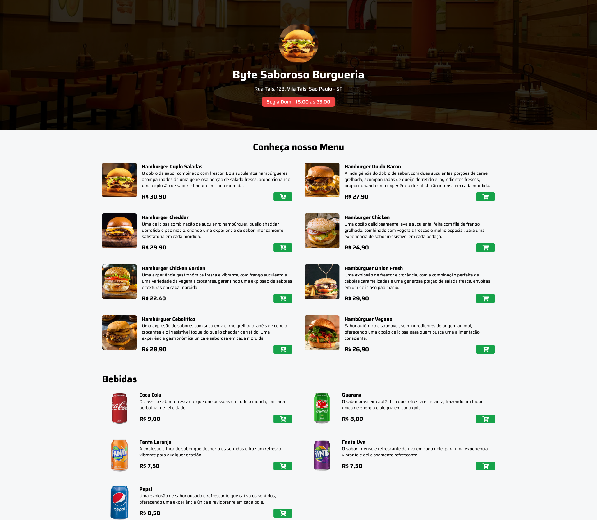

<h1 align="left"> Dashboard </h1>

<b>Site para Hamburgueria</b> que desenvolvi do zero usando <b>HTML, CSS, Tailwindcss e JavaScript</b> 
Desenvolvi esse site conforme uma Aula de Tailwindcss que fiz para me aprimorar em Tailwindcss pois até então eu não possuia tanta Habilidade. 
Caso queira ver mais, hospedei ela: https://hambugueria.netlify.app/

 

  

## 🚀 Tecnologias Usadas

Esse projeto foi desenvolvido com as seguintes tecnologias:

- HTML e CSS
- Tailwindcss
- JavaScript
- Git e Github

O projeto foi feito no <b>Visual Studio Code.</b>
